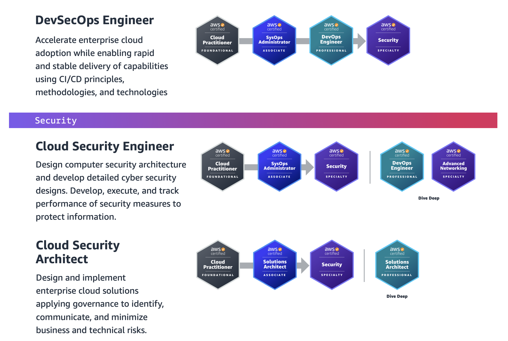

# AWS Certs

## The exam has the following content domains and weightings

- AWS Solutions Architect - Professional :white_check_mark:
- AWS Certified Security - Specialty :white_check_mark:
- AWS Certified SysOps Administrator - Associate :soon:
- AWS Certified DevOps Engineer - Professional :soon:
- AWS Certified Advanced Networking - Specialty :soon:

## Certs to pursue

|Icon|Meaning|
|--|--|
|:white_check_mark:|Knowledgable in this area|
|:large_orange_diamond:|Mid|
|:red_circle:|Knowledge/skills gap|