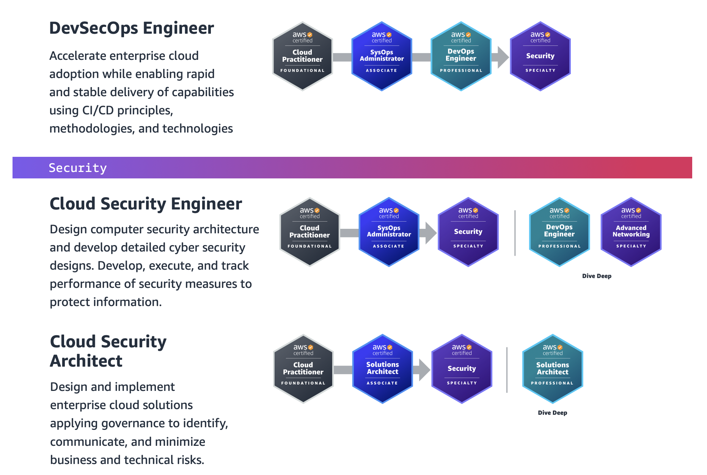

# AWS Security Specialty Cert

## The exam has the following content domains and weightings

- Domain 1: Threat Detection and Incident Response (**14%** of scored content)
- Domain 2: Security Logging and Monitoring (**18%** of scored content)
- Domain 3: Infrastructure Security (**20%** of scored content)
- Domain 4: Identity and Access Management (**16%** of scored content)
- Domain 5: Data Protection (**18%** of scored content)
- Domain 6: Management and Security Governance (**14%** of scored content)

## Certs to pursue

|Icon|Meaning|
|--|--|
|:white_check_mark:|Knowledgable in this area|
|:large_orange_diamond:|Mid|
|:red_circle:|Knowledge/skills gap|

## Final tasks

### Threat detection

- Review Secrets manager cheat sheet for rotating credentials
- 1.1 Review [ASFF](https://docs.aws.amazon.com/securityhub/latest/userguide/securityhub-findings-format.html) documentation
- 1.2 Review [Detective](https://docs.aws.amazon.com/detective/latest/adminguide/detective-terms-concepts.html)
- 1.2 Create a few metrics and dashboards in CloudWatch
- 1.3 AWS Lambda, AWS Step Functions, EventBridge, AWS Systems Manager runbooks and AWS Config for responding to alerts

### Security logging and monitoring

- 2.1 Setting up automated tools and scripts to perform regular audits (for example, by creating custom insights in Security Hub). Examples of these?
- 2.3 Review Route 53 DNS Query logging again
- 2.5 Review log analysis features of AWS services (for example, CloudWatch Logs Insights, CloudTrail Insights, Security Hub insights)

### Infrastructure security

- 3.1 Review applying restrictions at the edge based on various criteria (for example, geography, geolocation, rate limit)
- 3.3 EC2 image builder review, Creating hardened EC2 AMIs, pathing EC2 and container fleet (SSM)
- 3,4 Amazon Inspector Network Reachability

### IAM

- 4.1 IAM policy simulator (troubleshooting access)
- 4.1 Cognito security and MFA
- 4.2 constructing ABAC policies
  
### Data protection

- 5.1 TLS with CloudFront / Load balancers
- 5.1 cross-Region networking by using private VIFs and public VIFs refresher
- 5.2 Mechanisms to prevent prevention of public snapshots and public AMIs
- 5.3 review S3 data lifecycle configs / options
- 5.3 AWS Backup schedules / retention

### Management security & governance

- 6.1 AWS control tower requirements
- 6.2 multi-account tagging strategies
- 6.2 resource groups usage
- 6.2 sharing AWS resources using RAM
- 6.3 well-architected framework
